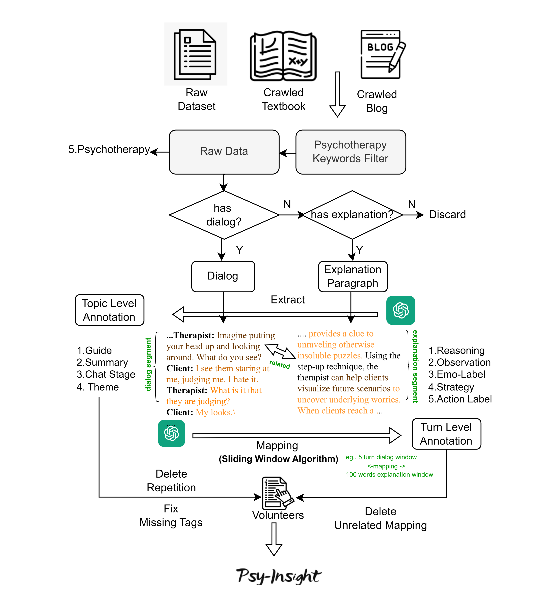

# Psy-Insight
Psy-Insight: Mental Health Oriented Interpretable Multi-turn Bilingual Counseling Dataset for Large Language Model Finetuning
## Flow Chart



### Chinese Example
```json
    {
        "theme": "",
        "chat_stage": "6th Session",
        "is_same_qa": 0,
        "is_same_case": 1,
        "background": "来访者是一个硕士生女性，面临合租问题。她可能对生活环境的整洁和责任分担有较强的关注。她需要找到一个与她生活理念相近的室友，以减少因家务问题带来的冲突和压力。",
        "guide": "治疗师通过提问、理解、鼓励来帮助来访者应对问题。"
        "pre_reasoning": "治疗师的策略包括通过提问引导来访者深入思考问题，如“那现在你打算怎么办呢？”；通过肯定和鼓励来访者增强信心，如“看到你有能力应对压力情境，真令人鼓舞”；通过理解和接纳缓解来访者的焦虑，如“我一点都没有觉得无趣啊”；以及引导来访者解决问题，如“你的意思是，如果我感到太过担心或者烦恼的话，那么，在我和导师见面之前来这里谈谈，会比之后再来要好，是这样么？”。",
        "topic_dialog": {
            "key": "fewshot",
            "unit_id": 163,
            "method": "Cognitive Behavioral Therapy",
            "dialog": [
                {
                    "text": "我一开始就不该找她合租，但是没办法，我需要个人来分担费用。她年纪比我小很多，而且生活理念也不同。该她分担的家务，她从来都不在乎自己是不是已经完成，也不在乎公寓里乱成什么样。我可不能那样过日子，于是我就跟她说了，结果她还不高兴了。我想她早就在另找房子了吧，现在一定是已经找到了。",
                    "participant": "来访者",
                    "observation": "因室友不分担家务且公寓凌乱而不满，表达了愤怒和无奈。",
                    "id": "163-0",
                    "emotional label": [
                        "Anger"
                    ]
                },
                {
                    "text": "那现在你打算怎么办呢？",
                    "participant": "治疗师",
                    "reasoning":"引导来访者深入思考问题",
                    "id": "164-0",
                    "strategy": [
                        "Question"
                    ]
                },
                {
                    "text": "在我做论文的研究部门里有个女人，我想她会有兴趣跟我合租。她现在承租的公寓正在卖，无论如何，她过几月也得搬家。",
                    "participant": "来访者",
                    "observation": "希望寻找寻找新合租者",
                    "id": "164-1",
                    "emotional label": [
                        "Neutral"
                    ]
                },
                {
                    "text": "那你怎么知道你们两个合得来呢？",
                    "participant": "治疗师",
                    "reasoning":"探究潜在问题",
                    "id": "164-2",
                    "strategy": [
                        "Question"
                    ]
                },
                {
                    "text": "我们两个年纪接近，似乎在很多事上的观点也都一致。我们在这个部门相处蛮久了，我想应该不错。",
                    "participant": "来访者",
                    "observation": "对新合租者的期望和信心",
                    "id": "164-3",
                    "emotional label": [
                        "Neutral"
                    ]
                },
                {
                    "text": "你在这个部门的工作性质是什么？",
                    "participant": "治疗师",
                    "reasoning": "了解背景",
                    "id": "164-4",
                    "strategy": [
                        "Question"
                    ]
                },
                {
                    "text": "我在参与一个针对领养父母的研究。领养安置之后我做跟进随访，最初，我们对领养父母的亲职能力做过一个评定，现在我要去了解其预估的准确度。",
                    "participant": "来访者",
                    "observation": "解释了其研究工作",
                    "id": "164-5",
                    "emotional label": [
                        "Neutral"
                    ]
                },
                {
                    "text": "这是你攻读博士学位的一部分么？",
                    "participant": "治疗师",
                    "reasoning":"",
                    "id": "164-6",
                    "strategy": [
                        "Question"
                    ]
                },
                {
                    "text": "我打算继续读书，以后拿博士学位，不过现在，我正在完成硕士论文。如果我的导师喜欢我做的研究，那么今年夏天我就能拿到硕士学位了。所以我要好好准备跟他的这次约谈。对了，要是下周我暂停一次和你见面，你会介意么？我要准备见他，时间不够用。",
                    "participant": "来访者",
                    "observation": "感到学业压力和焦虑",
                    "id": "164-7",
                    "emotional label": [
                        "Anxiety"
                    ]
                },
                {
                    "text": "面询是属于你的，你当然可以取消预约，不过我怀疑取消预约对你不是太好。",
                    "participant": "治疗师",
                    "reasoning":"提出建议，引导来访者解决问题",
                    "id": "164-8",
                    "strategy": [
                        "Affirmation and Reassurance"
                    ]
                },
                {
                    "text": "你的意思是，如果我感到太过担心或者烦恼的话，那么，在我和导师见面之前来这里谈谈，会比之后再来要好，是这样么？",
                    "participant": "来访者",
                    "observation": "因见导师前焦虑，询问是否提前见面较好",
                    "id": "164-9",
                    "emotional label": [
                        "Anxiety"
                    ]
                },
                {
                    "text": "正是。",
                    "reasoning":"",
                    "participant": "治疗师",
                    "id": "164-10",
                    "strategy": [
                        "Others"
                    ]
                },
                {
                    "text": "我想，下周我还是来吧。对于今天我告诉你的事，你有什么想法么？我想我该道歉，我今天说的尽是些鸡毛蒜皮，都是让人提不起兴趣的事，我的意思是，这些都不是心理层面上的问题。",
                    "participant": "来访者",
                    "observation": "表达歉意，认为自己谈的问题无趣",
                    "id": "164-11",
                    "emotional label": [
                        "Others"
                    ]
                },
                {
                    "text": "我一点都没有觉得无趣啊。看到你有能力应对压力情境，真令人鼓舞，而且了解这些对我来说也是重要的。",
                    "participant": "治疗师",
                    "reasoning":"肯定和鼓励来访者增强信心并理解和接纳缓解来访者的焦虑",
                    "id": "164-12",
                    "strategy": [
                        "Affirmation and Reassurance"
                    ]
                }
            ]
        },
        "post_reasoning": "在本次面询中，治疗师采取了多种策略来处理来访者的情绪和行为。首先，治疗师澄清了来访者的焦虑并指出其能力和潜在的成长空间，鼓励她积极参与治疗。治疗师还观察到来访者对自我认知和人际关系的困惑，理解她的需求并给予肯定和指导。此外，治疗师避免了对来访者的负面评价，而是以好奇心和理解回应她的挑战，让来访者感到被接纳和理解。治疗师的策略包括鼓励、肯定、理解和引导，以帮助来访者面对自身问题并获得成长。这些策略有助于建立积极的治疗关系，促进来访者的自我探索和改善。",
        "extra_tags": [],
    }
```
### Translation of the Chinese Example
```json

{
    "theme": "",
    "chat_stage": "6th Session",
    "is_same_qa": 0,
    "is_same_case": 1,
    "background": "The visitor is a female master's student dealing with a co-living issue. She is highly concerned about the cleanliness of her living environment and the sharing of responsibilities. She needs to find a roommate who shares her lifestyle to reduce conflicts and stress over household chores.",
    "guide": "The therapist helps the visitor cope with the problem through questioning, understanding, and encouragement.",
    "pre_reasoning": "The therapist's strategies include guiding the visitor to think deeply about the problem through questions like 'What do you plan to do now?'; boosting the visitor's confidence through affirmation and encouragement, such as 'It's encouraging to see you handle stressful situations'; easing the visitor's anxiety through understanding and acceptance, like 'I don't find it boring at all'; and guiding the visitor to solve problems, such as 'If I feel too worried or troubled, then coming here to talk before meeting my advisor would be better than coming after, right?'",
    "topic_dialog": {
        "key": "fewshot",
        "unit_id": 163,
        "method": "Cognitive Behavioral Therapy",
        "dialog": [
            {
                "text": "I shouldn't have started living with her, but I needed someone to share the costs. She's much younger than me and has a different lifestyle. She never cares whether she's done her share of chores or how messy the apartment is. I can't live like that, so I told her, and she got upset. I think she's already looking for another place, probably found one by now.",
                "participant": "Client",
                "observation": "Unhappy with roommate not sharing chores and messy apartment, expressing anger and helplessness.",
                "id": "163-0",
                "emotional label": [
                    "Anger"
                ]
            },
            {
                "text": "What do you plan to do now?",
                "participant": "Therapist",
                "reasoning": "Guiding the visitor to think deeply about the problem",
                "id": "164-0",
                "strategy": [
                    "Question"
                ]
            },
            {
                "text": "There's a woman in my research department who might be interested in co-living. Her current apartment is being sold, and she'll have to move in a few months anyway.",
                "participant": "Client",
                "observation": "Hoping to find a new roommate",
                "id": "164-1",
                "emotional label": [
                    "Neutral"
                ]
            },
            {
                "text": "How do you know you two will get along?",
                "participant": "Therapist",
                "reasoning": "Exploring potential issues",
                "id": "164-2",
                "strategy": [
                    "Question"
                ]
            },
            {
                "text": "We're close in age and seem to agree on many things. We've been working together in this department for a while, so I think it should be fine.",
                "participant": "Client",
                "observation": "Expectations and confidence in a new roommate",
                "id": "164-3",
                "emotional label": [
                    "Neutral"
                ]
            },
            {
                "text": "What is your role in this department?",
                "participant": "Therapist",
                "reasoning": "Understanding background",
                "id": "164-4",
                "strategy": [
                    "Question"
                ]
            },
            {
                "text": "I'm involved in a study on adoptive parents. I do follow-up visits after placements, and initially, we assessed the parenting abilities of the adoptive parents. Now, I'm looking into the accuracy of those assessments.",
                "participant": "Client",
                "observation": "Explaining her research work",
                "id": "164-5",
                "emotional label": [
                    "Neutral"
                ]
            },
            {
                "text": "Is this part of your doctoral studies?",
                "participant": "Therapist",
                "reasoning": "",
                "id": "164-6",
                "strategy": [
                    "Question"
                ]
            },
            {
                "text": "I plan to continue my studies and get a doctorate, but for now, I'm finishing my master's thesis. If my advisor likes my research, I can get my master's degree this summer. So I need to prepare well for our meeting. By the way, would it be okay if I skip our session next week? I'm running out of time to prepare.",
                "participant": "Client",
                "observation": "Feeling academic pressure and anxiety",
                "id": "164-7",
                "emotional label": [
                    "Anxiety"
                ]
            },
            {
                "text": "The sessions are yours, and you can cancel if you need to, but I doubt canceling would be good for you.",
                "participant": "Therapist",
                "reasoning": "Offering advice and guiding the visitor to solve problems",
                "id": "164-8",
                "strategy": [
                    "Affirmation and Reassurance"
                ]
            },
            {
                "text": "You mean if I feel too worried or troubled, then coming here to talk before meeting my advisor would be better than coming after, right?",
                "participant": "Client",
                "observation": "Anxious before meeting advisor, asking if it's better to come earlier",
                "id": "164-9",
                "emotional label": [
                    "Anxiety"
                ]
            },
            {
                "text": "Exactly.",
                "reasoning": "",
                "participant": "Therapist",
                "id": "164-10",
                "strategy": [
                    "Others"
                ]
            },
            {
                "text": "I think I'll come next week after all. Do you have any thoughts on what I've told you today? I feel like I should apologize; I've been talking about trivial things, nothing interesting or psychological.",
                "participant": "Client",
                "observation": "Expressing apology, feeling what she discussed is uninteresting",
                "id": "164-11",
                "emotional label": [
                    "Others"
                ]
            },
            {
                "text": "I don't find it boring at all. It's encouraging to see you handle stressful situations, and understanding this is important for me.",
                "participant": "Therapist",
                "reasoning": "Boosting the visitor's confidence and easing her anxiety through understanding and acceptance",
                "id": "164-12",
                "strategy": [
                    "Affirmation and Reassurance"
                ]
            }
        ]
    },
    "post_reasoning": "In this session, the therapist used various strategies to address the visitor's emotions and behaviors. The therapist clarified the visitor's anxiety and pointed out her capabilities and potential for growth, encouraging her active participation in therapy. The therapist also observed the visitor's confusion about self-awareness and interpersonal relationships, understanding her needs and providing affirmation and guidance. Additionally, the therapist avoided negative evaluations of the visitor and responded with curiosity and understanding to her challenges, making the visitor feel accepted and understood. The therapist's strategies included encouragement, affirmation, understanding, and guidance to help the visitor face her issues and grow. These strategies help build a positive therapeutic relationship, promoting the visitor's self-exploration and improvement.",
    "extra_tags": []
}
```
### English Example
```json
{
        "theme": "solution-focused brief therapy: building trust in the therapeutic relationship through acceptance and support for students sharing their experiences.",
        "is_same_qa": 0,
        "is_same_case": 0,
        "background": "A student confides in the therapist about a disturbing experience with her uncle and her concerns about her mother's reaction.",
        "pre_reasoning": "The student's willingness to share her experience may indicate that the therapist's acceptance and support have built trust in the therapeutic relationship.",
        "topic_dialog": {
            "key": "fewshot",
            "unit_id": 98,
            "method": "Solution-Focused Brief Therapy",
            "dialog": [
                {
                    "id": "98-0",
                    "participant": "Beth",
                    "text": "It’s my older uncle … He comes over a lot and stays with us, and sometimes my mom leaves us with him when she goes out. I liked him, but last semester he stayed over and he wanted to kiss me. I didn’t know what to do. My mom likes him a lot, and they are close. Now, he says he loves me, and he has put his hands on me, you know, my breasts. I just stood there and didn’t know what to do. I don’t want to let mom know; she would be mad at me.",
                    "observation": "Beth discloses a distressing experience involving her uncle, expressing confusion and fear about the situation and concern about her mother's reaction, indicating a complex family dynamic and her reluctance to cause conflict.",
                    "emotional label": [
                        "Fear",
                        "Shame"
                    ]
                },
                {
                    "id": "98-1",
                    "participant": "Therapist",
                    "text": "Thank you for taking the chance and trying to help your situation by sharing it with me. I understand how difficult it must have been for you keeping this secret and trying to protect your mom’s relationship with her brother. I admire your courage to take care of yourself given the very difficult situation you’ve been in. Do you have any ideas about how you would want to make this better and not have this happening?",
                    "reasoning": "The therapist acknowledges Beth's bravery in sharing her experience and offers support while encouraging her to consider ways to improve her situation, empowering her to take control and explore solutions.",
                    "strategy": [
                        "Question"
                    ]
                },
                {
                    "id": "98-2",
                    "participant": "Beth",
                    "text": "I’m aware of child protective services. They see some of my friends and their families. I don’t want to have to leave my mom, and I don’t want her to be mad at me.",
                    "observation": "Beth demonstrates awareness of potential support services but expresses concerns about the impact on her family dynamics, highlighting her internal conflict and the importance of maintaining her relationship with her mother.",
                    "emotional label": [
                        "Fear",
                        "Guilty"
                    ]
                },
                {
                    "id": "98-3",
                    "participant": "Therapist",
                    "text": "I agree that you should be able to stay in your home and also to have a good relationship with your mom. You are aware of child protective services. It is their job to help protect you and any other young person. I agree with you that it is best when you stay at home and make it a safe place for you and your brothers and sisters and your mom, too. From what you have shared, it would be important to contact child protective services. I know several people there, and I would like for you to help me make this contact so that you can make your home safe. Will you help make that happen?",
                    "reasoning": "The therapist validates Beth's desire to maintain her family relationships while emphasizing the importance of her safety, suggesting a collaborative approach to involve child protective services and ensure a safe environment for Beth and her family.",
                    "strategy": [
                        "Question"
                    ]
                },
                {
                    "id": "98-4",
                    "participant": "Beth",
                    "text": "I guess … But I’m still afraid of what mom might say and of her brother.",
                    "observation": "Beth expresses fear of potential repercussions within her family, indicating the internal struggle she faces in balancing her safety with her relationships and the challenging decisions ahead.",
                    "emotional label": [
                        "Anxiety",
                        "Fear"
                    ]
                },
                {
                    "id": "98-5",
                    "participant": "Therapist",
                    "text": "I understand your not wanting to upset your mom or even your uncle. It’s not an easy decision to make. What do you think would be the best way to handle this so that you don’t have to deal with your uncle’s behavior and you can feel safe?",
                    "reasoning": "The therapist acknowledges Beth's concerns and explores her thoughts on managing the situation delicately, encouraging her to consider strategies that prioritize her safety and well-being while navigating the complexities of family dynamics.",
                    "strategy": [
                        "Question"
                    ]
                },
                {
                    "id": "98-6",
                    "participant": "Beth",
                    "text": "Do you think the service worker would help me tell my mother and help make things easier after she finds out?",
                    "observation": "Beth's question reflects her uncertainty and concern about how to handle the situation with her mother, indicating a need for support and guidance.",
                    "emotional label": [
                        "Fear"
                    ]
                },
                {
                    "id": "98-7",
                    "participant": "Therapist",
                    "text": "I can only say that that is exactly the work they do with families in these situations. It’s important that you are safe and that your family can continue to be close. And it’s important that the worker understand what happened and then has your help in finding the best way to work with your mom. You can meet and talk with the worker here at school and help her understand the situation. Is that okay with you?",
                    "reasoning": "The therapist acknowledges Beth's concerns and offers reassurance by explaining the role of the service worker and emphasizing the importance of safety and family relationships. By involving Beth in the process and seeking her consent, the therapist empowers her to take an active role in seeking help and support.",
                    "strategy": [
                        "Question"
                    ]
                }
            ]
        },
        "post_reasoning": "The therapist reassures the student about involving child protective services and emphasizes the importance of ensuring her safety and maintaining family relationships. The therapist encourages the student to participate in the process of seeking help and support."
}
```

### Todo
We want to add a live chat window to our anonymous repository, but it seems that the website "anonymous" does not support dynamic web pages. We plan to fix this issue by June 25th.


